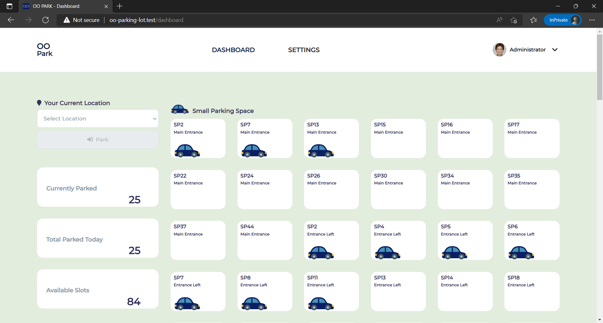
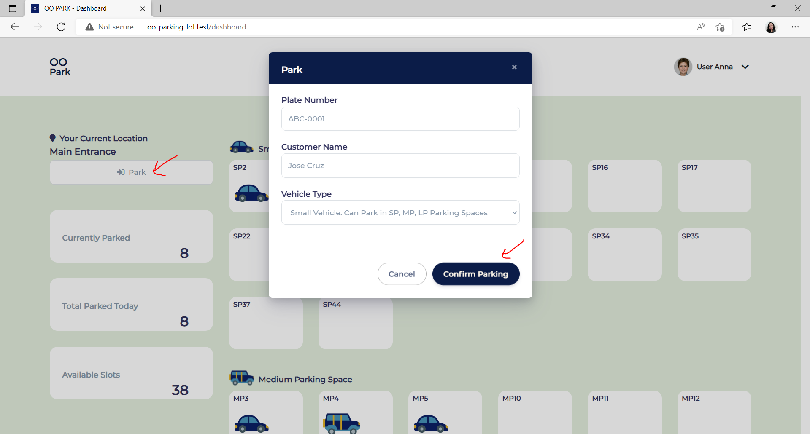
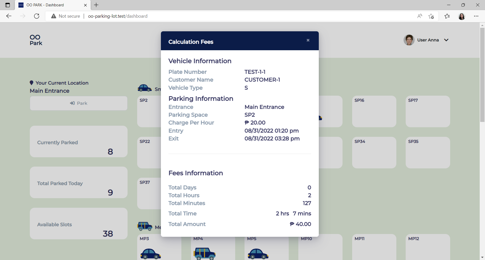
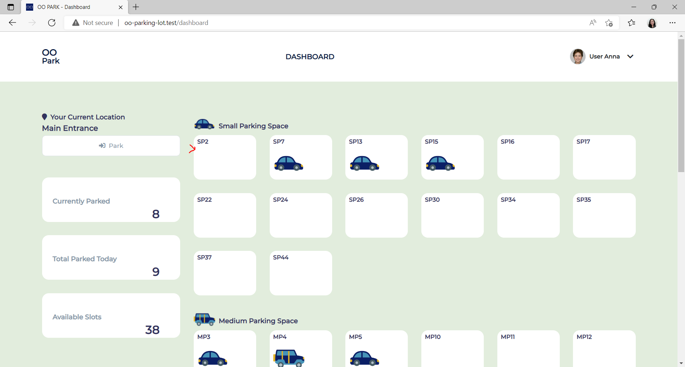

## Tech Stack

Backend: [Laravel 5.8](https://laravel.com/docs/5.8/readme)

Frontend: [VueJS v2](https://v2.vuejs.org/)

## Getting Started

### Install from repository

Clone the repository:

    git clone https://github.com/monettayy/oo-parking-lot.git

Navigate to the directory and run:

    composer install
    npm install

Copy the example .env file:

    cp .env.example .env

Generate an application key:

    php artisan key:generate

Run Mix tasks:

    npm run dev

View the website:

    php artisan serve
     
### Setup Database

Create your mysql database,
Go to the .env File and put your database credentials
    
    DB_DATABASE=your-database-here
    DB_USERNAME=root
    DB_PASSWORD=
    

**To seed the admin login credentials and Settings**,
In your terminal run:
    
    php artisan migrate
    php artisan db:seed

Optional, To seed some parking data, run:
    
    php artisan db:seed --class=TransactionSeeder

Optional, To reset database (already have data):
    
    php artisan migrate:refresh
    php artisan db:seed

To login in the website, use this seeded credentials:
    
    --------------------------
    Administrator Account
    --------------------------
    useraname:  admin
    password:   secret123

    --------------------------
    Parking Attendant Account
    --------------------------
    useraname:  anna
    password:   secret
    
    useraname:  john
    password:   secret

    useraname:  peter
    password:   secret

## Testing
### Sample Output
Landing

Login

Admin Dashboard

Parking Attendant Dashboard

Park

Parking Details

Unpark

Calculation Fees

Unparked

Exceeding 3 hours

Exceeding 24 hours

Returning within 1 hour

----------------------
**Notes**

Added Settings for Admin Account:

- Users 
    - CRUD
    - Every user is assigned to a Location / Entrance
- Entrances  
    - CRUD
    - May add new Entrances
    - Entrances will not be less than 3
- Slot Types
    - Editable description and charge per hour
- Vehicle Types
    - View Only
- Parking Slots
    - CRUD
    - Entrance, Slot Type and Distance from Entrance

Parking Slot Mapping
